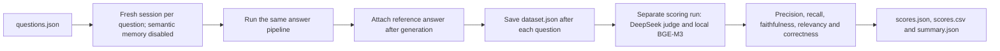

# SingleAgent project flowchart

The architecture follows a question from entry through routing, search-scope selection, document retrieval, and answer generation. It reflects `agent.py`, `retrieval.py`, the memory modules, and `guardrails/output_guard.py`. Retrieval counts are the defaults.

Routing, country identification, query rewriting, and document-type selection happen in one LLM triage call; they are expanded below to make each decision visible. Application code validates the output and enforces the country-coverage check. Multiple values within a filter are alternatives; different filter fields are combined with AND.

**Reading the diagram:** yellow boxes prepare text internally; blue boxes read or write memory; green boxes show user actions or delivery. Only **USER SEES** means the response has reached the user. Memory stores the prepared response; it does not generate it.

```mermaid
flowchart TD
    subgraph INPUT["1. Question enters the system"]
        A["User submits question through Gradio UI or command line"]
        B["Validate new message and READ last 3 turns from short-term memory"]
        A --> B
    end

    subgraph ROUTE["2. LLM decides whether retrieval is needed"]
        C{"Does the question require legal sources or a jurisdiction-specific answer?"}
        D["PREPARE direct answer internally"]
        F["PREPARE clarification text: specify countries and restate question"]
        B --> C
        C -->|"No: conversation or stable general fact"| D
        C -->|"Invalid router response or failure"| F
    end

    subgraph SELECT["3. LLM selects the search scope; code validates it"]
        E{"Are the requested countries clear from the question or prior user messages?"}
        CL["PREPARE clarification text: Which country or countries? Not yet displayed"]
        CQ["Create standalone search question and preserve all requested countries"]
        CS{"Are all countries supported: Italy, Estonia, Slovenia?"}
        LAW["Select legal area: Divorce, Inheritance, both, or no restriction if unclear"]
        DT{"Which document types does the question require?"}
        CASES["Legal Cases"]
        CODES["Civil Codes"]
        BOTH["No document-type restriction: search both"]
        CF["Validate and build metadata filter: requested countries AND legal area AND document type"]
        C -->|"Yes: legal rules, articles, case law, comparisons, or uncertainty"| E
        E -->|No| CL
        E -->|Yes| CQ
        CQ --> CS
        CS -->|Yes| LAW
        LAW --> DT
        DT -->|"Explicit case-law request"| CASES
        DT -->|"Statutory text, rights, conditions, duties, or deadlines"| CODES
        DT -->|"Rules plus judicial practice, or unspecified"| BOTH
        CASES --> CF
        CODES --> CF
        BOTH --> CF
        CF -->|"Invalid filters"| F
    end

    subgraph RETRIEVE["4. Retrieve, filter, and rank documents"]
        G["Encode standalone question with BGE-M3"]
        I["Pinecone vector search with metadata filters: up to 20 candidates"]
        DB[("Existing legal-rag corpus")]
        J["Remove chunks with missing text or citation labels, and labels shared by different sources"]
        K["Rank remaining chunks with BGE reranker; keep top 5"]
        CC{"Non-empty results, every chunk has a country, and country set exactly matches request?"}
        DROP["Exclude retrieved documents from the answer"]
        CF -->|"Valid filters"| G
        G --> I
        DB -.-> I
        CF -. "Country, legal area, document type" .-> I
        I --> J
        J --> K
        K --> CC
        CC -->|No| DROP
    end

    subgraph ANSWER["5. Generate and check the answer"]
        N["Recall similar Q&A for the same agent and exact country set"]
        LT[("Chroma long-term memory")]
        O["GENERATE answer internally from retrieved legal evidence with exact source citations"]
        P["Verify up to 10 citation / claim pairs; attempt one correction for unknown or unsupported citations"]
        S{"All parsed citations verified?"}
        T["FINALIZE verified answer internally; not yet displayed"]
        U["ADD verification notice to answer internally; not yet displayed"]
        M["PREPARE general-knowledge answer with corpus disclosure and uncertainty; not yet displayed"]
        CC -->|Yes| N
        LT -. "Background only" .-> N
        N --> O
        CQ -. "Standalone question" .-> O
        B -. "Original question and conversation" .-> O
        O --> P
        P --> S
        S -->|Yes| T
        S -->|No| U
        CS -->|"No: unsupported country or combination"| M
        DROP --> M
    end

    subgraph OUTPUT["6. Save internally, THEN deliver to the user"]
        V["WRITE current user message + prepared response to short-term memory"]
        H["Save same turn and used documents in persistent chat history"]
        W{"Retrieved sources present and citations verified?"}
        X["Summarize and store rewritten Q&A in long-term memory"]
        Y["RETURN result from agent.ask to UI or command line"]
        DISPLAY["USER SEES the answer or clarification now; current execution ends"]
        WAIT["WAIT for another user message; no automatic restart"]
        NEXT["USER SENDS a new message, for example: Italy"]
        D --> V
        CL --> V
        F --> V
        M --> V
        T --> V
        U --> V
        V --> H
        H --> W
        W -->|Yes| X
        X --> LT
        X --> Y
        W -->|No| Y
    end
    Y --> DISPLAY
    DISPLAY --> WAIT
    WAIT -->|"Only when user submits"| NEXT
    NEXT -->|"New call; router combines message with previous context"| A

    classDef userEvent fill:#dcfce7,stroke:#15803d,color:#14532d;
    classDef memoryStep fill:#dbeafe,stroke:#2563eb,color:#1e3a8a;
    classDef prepared fill:#fef3c7,stroke:#d97706,color:#78350f;
    class A,DISPLAY,NEXT userEvent;
    class B,V,H memoryStep;
    class D,F,CL,T,U,M prepared;
```



- Jurisdiction-dependent legal questions require a clear country set. A country-only reply resumes the pending question using conversation context; countries mentioned only by the assistant are not adopted as user intent.
- RAG answers use retrieved documents as the sole evidence for legal claims; recalled Q&A is background only. Country coverage is checked across the final retrieved chunks, not the entire corpus.
- Unsupported countries, empty results, or a mismatched country set use general LLM knowledge, with an explicit disclosure, uncertainty where appropriate, and no invented citations or claims of current-law verification. These answers are not stored in long-term memory.
- Invalid triage or filter output asks for clarification. Caller-configured filters still apply; empty filtered results are not retried without filters.
- Retrieval and answer-generation failures normally propagate to the caller. Failures inside triage, including its unsupported-country answer generation, return a clarification instead. Memory recall/save failures are logged and do not stop the answer.
- Direct answers, clarifications, and LLM fallback answers bypass citation checking. Verification covers parsed citations, not every uncited claim.
- Full history is retained in SQLite with a JSON export. New sessions reset short-term context; reopening a session restores its turns.

## Clarification example: two separate executions

This sequence expands the clarification loop. The first execution finishes before the user supplies the country. The country is a new message, not an answer collected inside the clarification-preparation box.

```mermaid
sequenceDiagram
    actor User
    participant UI as UI / command line
    participant Agent as SingleAgentRAG.ask
    participant STM as Short-term memory
    participant LLM as Router / answer LLM
    participant Docs as Retriever
    participant History as Chat history

    rect rgb(245, 245, 245)
        Note over User,History: TURN 1 — original question without country
        User->>UI: How does divorce work?
        UI->>Agent: New call with original question
        Agent->>STM: Read recent turns
        STM-->>Agent: Conversation context
        Agent->>LLM: Route question with context
        LLM-->>Agent: Retrieval needed; requested countries empty
        Note over Agent: Prepare clarification text internally
        Agent->>STM: Save original question + clarification text
        Agent->>History: Save same turn
        Agent-->>UI: Return clarification
        UI-->>User: Which country or countries are you referring to?
        Note over User,Agent: First execution ENDS. Wait for the user.
    end

    rect rgb(235, 245, 255)
        Note over User,History: TURN 2 — user supplies the country
        User->>UI: Italy
        UI->>Agent: NEW call with message: Italy
        Agent->>STM: Read recent turns
        STM-->>Agent: Original question + previous clarification
        Agent->>LLM: Route Italy with previous conversation
        LLM-->>Agent: Standalone question: How does divorce work in Italy? + filters
        Agent->>Docs: Retrieve documents using standalone question and filters
        Docs-->>Agent: Ranked documents
        Note over Agent: Check country coverage; recall background if using RAG
        Agent->>LLM: Generate answer to the resolved legal question
        LLM-->>Agent: Prepared legal answer
        Note over Agent: If RAG: check citations and finalize text, adding notice if needed
        Agent->>STM: Save Italy + finalized legal answer
        Agent->>History: Save same turn and used sources
        Note over Agent: Store long-term Q&A only if sources present and citations verified
        Agent-->>UI: Return finalized legal answer
        UI-->>User: Legal answer about divorce in Italy
        Note over User,Agent: Second execution ENDS
    end
```

The second turn stores the actual user message **Italy** in short-term memory, paired with the final answer. The reconstructed standalone question is used for retrieval; it does not replace the user's message in short-term memory.

## Evaluation flow



Collection records generation failures and continues. Reference answers are never supplied to answer generation.
